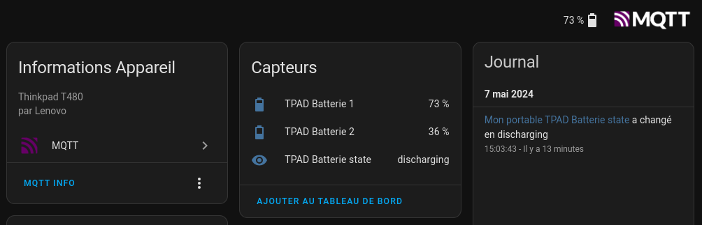

# SENSOR_MQTT

Programme python qui va lire le niveau des batteries et son état "charging/discharging"


## Configuration

Configuration définie dans le `config.json`

```json
{
    "mqtt_server": "mqtt",
    "mqtt_user": "mosquitto",
    "mqtt_pwd": "mypathword",
    "device_id": "tpad",
    "refresh_interval": 45,
    "sensors": {
        "battery1_percent": {
            "topic": "battery1_percent"
        },
        "battery2_percent": {
            "topic": "battery2_percent"
        },
        "battery_state": {
            "topic": "battery_state"
        }
    }
}
```

## Installation de l'application

```shell
sudo apt install python3-paho-mqtt
```

## Démarrage
```shell
python3 sensor.py
```

## Installation du service

```ini
# sensor_mqtt.service
[Unit]
Description=Sensor MQTT
After=networking.target

[Service]
WorkingDirectory=/home/billerot/dev/sensor_mqtt/
ExecStart=/usr/bin/python3 -m sensor
Restart=always
RestartSec=30

[Install]
WantedBy=default.target
```

```shell
sudo cp /home/billerot/dev/sensor_mqtt/sensor_mqtt.service /etc/systemd/system/sensor_mqtt.service
sudo systemctl start sensor_mqtt
sudo systemctl enable sensor_mqtt
```

## Déclaration dans Home Assistant

```yaml
# mqtt.yaml
sensor:
  - name: "TPAD Batterie 1"
    state_topic: battery1_percent
    unique_id: battery1_percent
    state_class: measurement
    unit_of_measurement: "%"
    device_class: battery
    device:
      name: "Mon portable"
      identifiers: "tpad"
      manufacturer: "Lenovo"
      model: "Thinkpad T480"    
  - name: "TPAD Batterie 2"
    state_topic: battery2_percent
    unique_id: battery2_percent
    state_class: measurement
    unit_of_measurement: "%"
    device_class: battery
    device:
      name: "Mon portable"
      identifiers: "tpad"
      manufacturer: "Lenovo"
      model: "Thinkpad T480"    
  - name: "TPAD Batterie state"
    state_topic: battery_state
    unique_id: battery_state
    device:
      name: "Mon portable"
      identifiers: "tpad"
      manufacturer: "Lenovo"
      model: "Thinkpad T480"    
```
