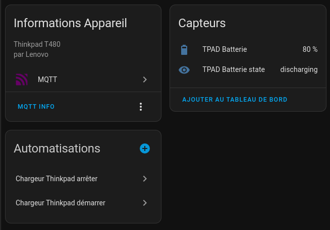
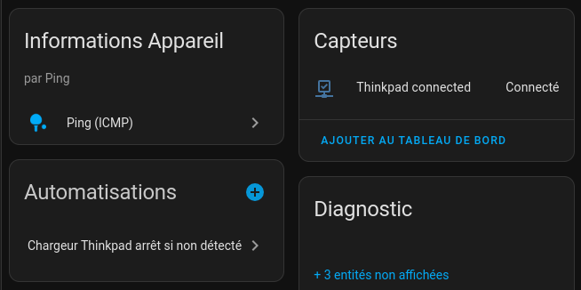
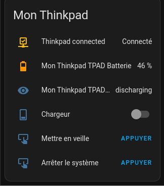

# SENSOR_MQTT

Programme python avec l'extension mqtt 
pour lire le niveau et l'état des batteries de mon pc portable.

Via Home Assistant, je pilote le chargeur en fonction du niveau des batteries.

Possibilité de piloter la mise en veille et l'arrêt du portable.

## Configuration

Configuration définie dans le `config.json`

```json
{
    "mqtt_server": "mqtt",
    "mqtt_user": "mosquitto",
    "mqtt_pwd": "mypathword",
    "device_id": "tpad",
    "refresh_interval": 45,
    "sensors": {
        "battery_percent": {
            "topic": "battery_percent"
        },
        "battery_state": {
            "topic": "battery_state"
        }
    }
}
```

## Installation de l'application

https://pypi.org/project/paho-mqtt/

```shell
sudo apt install python3-paho-mqtt
```

## Démarrage
```shell
python3 sensor.py
```

## Installation du service

```ini
# sensor_mqtt.service à recopier dans /etc/systemd/system/
[Unit]
Description=Sensor MQTT
After=networking.target

[Service]
TimeoutSec=infinity # ne bloque plus la mise en veille
WorkingDirectory=/home/billerot/dev/sensor_mqtt/
ExecStart=/usr/bin/python3 -m sensor
Restart=always
RestartSec=30

[Install]
WantedBy=multi-user.target
```

Aide mémoire des commandes pour installer / mettre à jour / supprimer le service
```shell
sudo cp /home/billerot/dev/sensor_mqtt/sensor_mqtt.service /etc/systemd/system/sensor_mqtt.service
sudo systemctl start sensor_mqtt
sudo systemctl enable sensor_mqtt

sudo systemctl stop sensor_mqtt
sudo systemctl disable sensor_mqtt

sudo rm /etc/systemd/system/sensor_mqtt
sudo systemctl daemon-reload
```

## Déclaration dans Home Assistant





```yaml
# mqtt.yaml
sensor:
  - name: "TPAD Batterie"
    state_topic: battery_percent
    unique_id: battery_percent
    state_class: measurement
    unit_of_measurement: "%"
    device_class: battery
    device:
      name: "Mon Thinkpad"
      identifiers: "tpad"
      manufacturer: "Lenovo"
      model: "Thinkpad T480"    
  - name: "TPAD Batterie state"
    state_topic: battery_state
    unique_id: battery_state
    device:
      name: "Mon Thinkpad"
      identifiers: "tpad"
      manufacturer: "Lenovo"
      model: "Thinkpad T480"    
button:
  - name: "Mettre en veille"
    command_topic: "tpad/command"
    payload_press: "systemctl suspend"
  - name: "Arrêter le système"
    command_topic: "tpad/command"
    payload_press: "systemctl poweroff"
```

## Automation

```yaml
- id: '1715241162691'
  alias: Chargeur Thinkpad démarrer
  description: ''
  trigger:
  - platform: numeric_state
    entity_id:
    - sensor.mon_thinkpad_tpad_batterie
    below: 20
  condition: []
  action:
  - service: switch.turn_on
    target:
      entity_id:
      - switch.relate_relais
    data: {}
  mode: single
- id: '1715241449697'
  alias: Chargeur Thinkpad arrêter
  description: ''
  trigger:
  - platform: numeric_state
    entity_id:
    - sensor.mon_thinkpad_tpad_batterie
    above: 85
  condition: []
  action:
  - service: switch.turn_off
    metadata: {}
    data: {}
    target:
      entity_id: switch.relate_relais
  mode: single
- id: '1715245232196'
  alias: Chargeur Thinkpad arrêt si non détecté
  description: ''
  trigger:
  - type: not_connected
    platform: device
    device_id: afdc2baad7d9b1c2bd399e40aa27443b
    entity_id: cb6a0e8342de05c377e4b89eba903e35
    domain: binary_sensor
  condition: []
  action:
  - service: switch.turn_off
    metadata: {}
    data: {}
    target:
      entity_id: switch.relate_relais
  mode: single
```